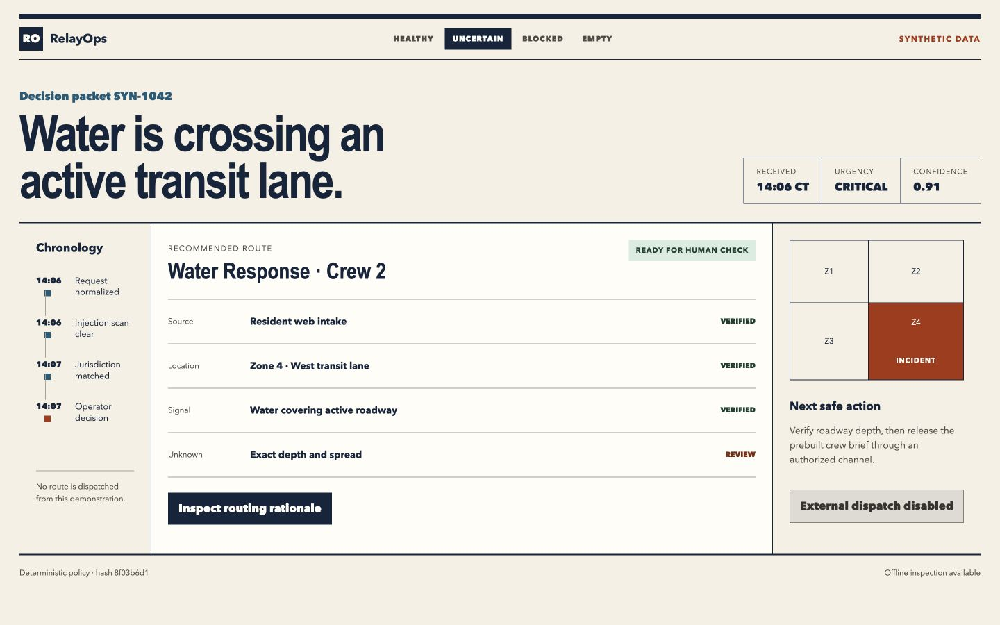
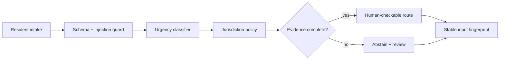

# RelayOps AI

**Evidence-bound intake and routing for synthetic municipal field operations.**

> All people, organizations, records, measurements, and outcomes in this
> repository are synthetic.



[Open the live demonstration](https://jermaine-anugwom.github.io/relayops-ai/)

## Run it locally

Requires Git and Docker with Compose v2. Initial setup downloads dependencies and images; no model key is needed.

```bash
git clone https://github.com/Jermaine-Anugwom/relayops-ai.git
cd relayops-ai
docker compose up --build
```

Open the [interface](http://127.0.0.1:3000) or [API documentation](http://127.0.0.1:8000/docs).
The interface replays a static synthetic fixture alongside the API; it is not API-produced evidence.

## The operational problem

Operations teams receive incomplete, duplicated, urgent, and sometimes hostile service requests through inconsistent channels.

## The proof

A deterministic category, urgency, and route classifier that sends suspicious instructions, missing locations, and low-confidence requests to review. Each input receives a stable evidence fingerprint.

## Why this is forward deployed

The project begins with the operator's decision, uncertainty, failure cost,
integration boundary, and handoff—not with a model demo. It makes policy and
evidence inspectable, preserves human authority for consequential cases, and
remains useful when the optional model layer is unavailable.

## Architecture



## Python-only setup

From the cloned repository, with Python 3.12 installed:

```bash
python3.12 -m venv .venv
source .venv/bin/activate
python -m pip install -c constraints.txt -e '.[dev]'
pytest -q
relayops
```

The API uses local synthetic data. Dependency installation requires a network connection; running the demonstration needs no model key.

## Evaluation and limitations

Run `pytest -q` for the reproducible evaluation. The fixture set is deliberately
synthetic and cannot establish production performance. A real deployment would
require operator observation, representative data, policy review, privacy review,
security testing, and a monitored rollout.

## Project documents

- [Field discovery and handoff](FIELD_NOTES.md)
- [Security boundaries](SECURITY.md)
- [Operating runbook](RUNBOOK.md)
- [Development provenance](DEVELOPMENT.md)
- [Release history](CHANGELOG.md)

## Topics

`forward-deployed-ai`, `govtech`, `fastapi`, `nextjs`, `human-in-the-loop`, `ai-evals`
